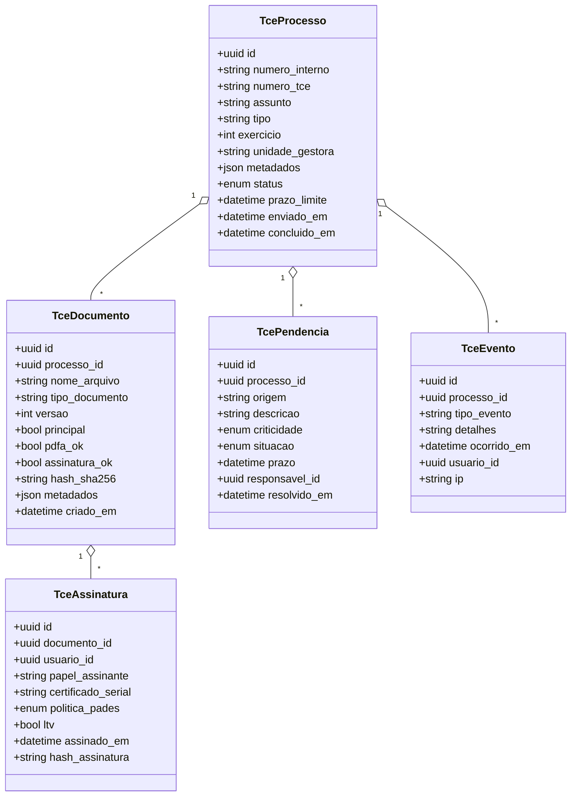

# Módulo Tribunal de Contas (TCE)

> **Objetivo**: prover um pacote completo para integração com o Tribunal de Contas (TCE), cobrindo *coleta/centralização de documentos*, *validação automática*, *preferência por PDF/A*, *assinatura digital ICP‑Brasil*, *gestão de prazos e calendário do TCE*, *painel de pendências*, *notificações*, *controle de versões e múltiplas assinaturas*, *organização por processos*, *portal de auditoria/transparência* e *relatórios internos*.

---

## 1) Visão Geral do Fluxo

```mermaid
flowchart LR
    A[Origem: Proposições/Processos Internos] --> B[Preparação de Dossiê TCE]
    B --> C[Validação Automática (PDF/A, metadados, assinaturas)]
    C --> D[Assinaturas ICP-Brasil (múltiplos signatários)]
    D --> E[Versões & Carimbo do Tempo]
    E --> F[Envio/Protocolo TCE]
    F --> G[Recepção de Devolutivas (pendências/alertas)]
    G --> H[Painel de Pendências & Prazos]
    H --> I[Relatórios Internos & Portal de Auditoria]
```

---

## 2) Escopo Funcional (por tela)

### 2.1 Tela: **Dashboard TCE**
**Objetivo:** visão executiva do status de conformidade e dos prazos.
- **Cards-chave**: Processos abertos | Itens prontos para envio | Pendências críticas | Prazos a vencer (7/15/30 dias) | Taxa de conformidade PDF/A | Assinaturas pendentes.
- **Gráficos**: evolução mensal de processos enviados, tempo médio de regularização de pendências, distribuição por secretaria/unidade.
- **Atalhos**: Criar processo TCE · Importar dossiê · Validar em lote · Assinar em lote · Configurar calendário.

### 2.2 Tela: **Catálogo de Processos (TCE)**
- **Lista** com filtros: status (rascunho, em validação, pronto para envio, enviado, devolvido, concluído), órgão/unidade, período, tipo de processo (contas, contratos, licitações, atos), responsável, presença de pendências.
- **Colunas**: Nº Interno · Nº TCE (quando disponível) · Assunto · Responsável · Versão atual · Assinaturas pendentes · Conformidade PDF/A · Data limite · Situação.
- **Ações em massa**: validar, assinar, enviar, exportar (ZIP, planilha), atribuir responsável.

### 2.3 Tela: **Processo TCE – Detalhe**
- **Abas**:
  1. **Resumo** (metadados principais: exercício, unidade gestora, natureza do processo, palavras‑chave, histórico de eventos)
  2. **Documentos** (lista, ordenação, pré‑visualização, metadados, *tags* de classificação, indicação de *documento principal*)
  3. **Validações** (checklist automático com resultado por regra: PDF/A, campos obrigatórios, assinaturas válidas, integridade de anexos, nomeação padrão)
  4. **Assinaturas** (workflow de múltiplos signatários, ordem, políticas PAdES, carimbo do tempo)
  5. **Envio & Protocolo** (credenciais, endpoint, recibo, hash e logs)
  6. **Pendências & Devolutivas** (lista, origem, prazo, SLA, tratativa, anexos de correção)
  7. **Linha do Tempo** (eventos: upload, validação, assinatura, envio, retorno, reenvios)

### 2.4 Tela: **Painel de Pendências**
- **Quadro Kanban**: *Nova* → *Em análise* → *Aguardando correção* → *Pronta para reenvio* → *Resolvida*.
- **Filtros**: por órgão, tipo de pendência (documental, assinatura, metadado, prazo), criticidade, responsável.
- **SLA**: indicador de atraso, *badge* com dias restantes, notificação automática.

### 2.5 Tela: **Calendário do TCE**
- **Visões**: mensal/semanal/lista.
- **Eventos**: prazos legais, sessões, marcos de prestação de contas, datas de remessa por tipo de processo.
- **Sincronização**: iCal/ICS de leitura; importação de calendário oficial.

### 2.6 Tela: **Assinaturas (Lote e Individual)**
- **Suporte a múltiplos signatários** (papéis: ordenador de despesas, presidente, contador, controlador interno, procurador, etc.).
- **Políticas**: PAdES‑B/LT, inclusão de *timestamp* (TSA), cadeia ICP‑Brasil completa.
- **Experiência**: seleção de documentos, ordem de assinatura, aviso de pendências, pré-validação antes de aposição.

### 2.7 Tela: **Relatórios Internos**
- **Modelos**: processos por unidade, pendências por criticidade, tempo de ciclo, conformidade por regra, comparativo por exercício, histórico por fornecedor/contrato.
- **Exportações**: PDF, XLSX, CSV, JSON (com metadados e hashes).

### 2.8 Tela: **Portal de Auditoria & Transparência** (público)
- **Busca** por processo, assunto, exercício, unidade gestora.
- **Publicação seletiva**: ocultar dados sigilosos, publicar hashes/recibos, *watermark* "Cópia – Sem Valor Legal" quando aplicável.

---

## 3) Regras de Negócio & Validações

### 3.1 Conformidade de Documentos
- **PDF/A preferencial**: detectar perfil (A‑1, A‑2, A‑3), recusar quando obrigatório.
- **Nomeação padrão**: `TIPO_NUMERO_ANO_VERSAO.pdf` (ex.: `CONTRATO_045_2025_v2.pdf`).
- **Metadados mínimos**: tipo, exercício, UG, assunto, palavras‑chave, referência processual.
- **Proibições**: senhas em PDFs, campos editáveis em versão final, anexos duplicados.

### 3.2 Assinaturas Digitais (ICP‑Brasil)
- **Obrigatório**: certificados ICP‑Brasil (A1/A3) com verificação de cadeia e status revogação (CRL/OCSP).
- **Política PAdES**: validação pós‑assinatura, presença de *timestamp*, LTV quando possível.
- **Múltiplos signatários**: ordem, substituição (delegação), rejeição com justificativa, reabertura controlada.

### 3.3 Gestão de Prazos
- **Data limite por tipo de processo** (parametrizável).
- **Recalculo automático** ao receber devolutiva.
- **Alertas**: D‑15/D‑7/D‑1, *push* e e‑mail, canal Webhook.

### 3.4 Devolutivas & Pendências
- **Classificação**: documental, formal, técnica, assinatura, metadado.
- **Tratativa**: responsável, prazo, plano de ação, anexos de correção.
- **Auditoria**: tudo fica na linha do tempo com usuário, IP, hash e carimbo de tempo.

---

## 4) Modelo de Dados (alto nível)



**Enum `status`**: `rascunho`, `validando`, `pronto_envio`, `enviado`, `devolvido`, `concluido`.

**Enum `criticidade`**: `baixa`, `media`, `alta`, `bloqueante`.

**Enum `situacao pendência`**: `nova`, `em_analise`, `aguardando_correcao`, `pronta_reenvio`, `resolvida`.

---

## 5) APIs & Integrações (exemplo)

### 5.1 Endpoints Internos (REST)
- `POST /api/tce/processos` – cria processo
- `GET /api/tce/processos?status=...` – lista com filtros/paginação
- `GET /api/tce/processos/{id}` – detalhe
- `POST /api/tce/processos/{id}/validar` – dispara validação
- `POST /api/tce/processos/{id}/assinar` – inicia fluxo de assinatura (individual ou em lote)
- `POST /api/tce/processos/{id}/enviar` – envia ao TCE (ou queue)
- `POST /api/tce/processos/{id}/receber` – callback/devolutiva do TCE
- `POST /api/tce/processos/{id}/pendencias` – abre pendência
- `PATCH /api/tce/pendencias/{id}` – atualiza situação

**Observação**: para **assinaturas**, expor também endpoints de *preflight* (validar certificado, política) e *postflight* (verificar LTV, timestamp, cadeia).

### 5.2 Webhooks
- `POST /hooks/tce/devolutiva` – recebe pendências/retornos
- `POST /hooks/tce/recibo` – recebe comprovante com nº de protocolo

### 5.3 Integrações externas
- **Assinatura**: serviço de assinatura ICP‑Brasil (PyHanko/Outros) com PAdES‑B/LT.
- **Validação PDF/A**: biblioteca/serviço que detecta e valida o perfil PDF/A.
- **Armazenamento**: S3/compatível para versões e ARNs de *object lock* (imutabilidade quando exigida).
- **Calendário**: ingestão ICS, parametrização de eventos oficiais.

---

## 6) Regras de Segurança & Auditoria
- **RBAC**: perfis (Administrador TCE, Responsável UG, Assinante, Auditor Interno, Leitura).
- **Assinaturas**: nunca trafegar PFX sem criptografia; HSM/A3 preferível; *pinning* de certificados confiáveis.
- **Logs**: 100% dos eventos relevantes com IP, *user‑agent*, hash do conteúdo e horário (UTC e local).
- **Imutabilidade**: ao concluir, bloquear alterações de documentos, preservando versões e provas de integridade (hash + recibos).
- **LGPD**: mascaramento/pseudonimização em relatórios públicos.

---

## 7) UX/Usabilidade & Acessibilidade
- **Ações em massa** (validar, assinar, enviar) com *progress* e *rollback* por item.
- **Rótulos claros**: “Pronto para envio”, “Assinaturas pendentes (2/4)”.
- **A11y**: contraste AA, navegação por teclado, *aria‑labels*, foco visível.
- **Feedbacks**: *toasts* (sucesso/erro), *modals* para confirmações de envio.

---

## 8) Tarefas Assíncronas & Rotinas
- **Fila `tce-validate`**: validação de PDF/A, metadados, duplicidade.
- **Fila `tce-sign`**: aposição de assinaturas e verificação posterior (LTV/TSA).
- **Fila `tce-send`**: empacotamento, envio e confirmação de protocolo.
- **Agendadores**: verificação diária de prazos, ingestão de calendário, reprocessamento de pendências.

---

## 9) Critérios de Aceitação (PoC)
1. **Criar processo**, anexar documentos, validar automaticamente → status “pronto_envio”.
2. **Assinar** 2+ documentos com 3 perfis distintos → PAdES‑LT válido.
3. **Enviar** e **registrar recibo** (simulado ou real) com número de protocolo → guardar hash/recibo.
4. **Receber devolutiva** → abrir pendência com prazo e classificar criticidade.
5. **Resolver pendência** → revalidar, reenviar, registrar nova versão.
6. **Relatórios** funcionam (pendências por unidade, SLA, evolução mensal).
7. **Portal público** exibe processo/recibo (quando marcado como público) sem dados sigilosos.

---

## 10) Métricas & KPIs
- Tempo médio de validação/assinatura/envio.
- % de documentos em PDF/A na primeira tentativa.
- % de processos com pendência e tempo de resolução.
- Adesão a prazos (no prazo x atrasados).

---

## 11) Configuração & Deploy
- **Variáveis**: `TCE_ENDPOINT`, `TCE_TOKEN`, `TCE_CALENDAR_ICS_URL`, `PDFA_ENFORCE=true`, `P7S_POLICY=PAdES-LT`, `TSA_URL`, `OCSP_CRL_CHECK=true`.
- **Docker/Compose**: serviços para *worker* e *scheduler*; volume S3; healthchecks em `/health/tce`.
- **Ambientes**: *dev* (sandbox), *homolog* (dados mascarados), *prod* (chaves e segredos via vault).

---

## 12) Anexos (Modelos)
- **Checklist de Validação** (JSON) – regras parametrizáveis por tipo de processo.
- **Template de Relatório** (XLSX/PDF) – pivot por unidade/criticidade.
- **Modelo de *Webhook* de Devolutiva** (JSON):
```json
{
  "numero_tce": "2025-000123",
  "processo_interno": "PROC-45-2025",
  "itens": [
    {"tipo": "assinatura", "descricao": "Assinatura do ordenador ausente", "criticidade": "alta", "prazo": "2025-10-20"},
    {"tipo": "pdfa", "descricao": "Documento X não está PDF/A", "criticidade": "media", "prazo": "2025-10-15"}
  ]
}
```

---

## 13) Roadmap Sugerido
- **Fase 1**: Validação, Assinaturas, Catálogo de Processos, Painel de Pendências.
- **Fase 2**: Envio/Protocolo + Webhooks + Calendário + Relatórios.
- **Fase 3**: Portal de Auditoria + LTV/TSA + Políticas avançadas e integrações específicas do TCE.

> Este documento é base para desenho de UI, backlog e PoC. Ajuste as regras/validações conforme o caderno técnico do TCE local e as normativas vigentes.

